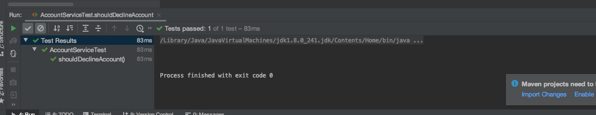

## Configuring return values of mocked method ##
- Also called method stubbing
- Also called setting expectation

Let us consider we do have class as given below:

```java
package raj.mockito.revise;

import java.io.IOException;
import java.time.LocalDate;

public class AccountService {

    private static final String UNACCEPTABLE_RISK_PROFILE = "HIGH";
    private BackgroundCheckService backgroundCheckService;
    private ReferenceIdsManager referenceIdsManager;
    private AccountRepository accountRepository;


    public AccountService(BackgroundCheckService backgroundCheckService,
                          ReferenceIdsManager referenceIdsManager,
                          AccountRepository accountRepository) {
        this.backgroundCheckService = backgroundCheckService;
        this.referenceIdsManager = referenceIdsManager;
        this.accountRepository = accountRepository;
    }


    public AccountOpeningStatus openAccount(String firstName, String lastName, String taxId, LocalDate dob)
            throws IOException {

        final BackgroundCheckResults backgroundCheckResults = backgroundCheckService.confirm(firstName,
                lastName,
                taxId,
                dob);

        if (backgroundCheckResults == null || backgroundCheckResults.getRiskProfile().equals(UNACCEPTABLE_RISK_PROFILE)) {
            return AccountOpeningStatus.DECLINED;
        } else {
            final String id = referenceIdsManager.obtainId(firstName, lastName, taxId, dob);
            if (id != null) {
                accountRepository.save(id, firstName, lastName, taxId, dob, backgroundCheckResults);
                return AccountOpeningStatus.OPENED;
            } else {
                return AccountOpeningStatus.DECLINED;
            }
        }
    }
}
```
In our last tutorial, mock and injected dependencies for AccountService. 
This time, let's do method subbing. The method stubbing is done with the help of when.
According to when, when
```java
backgroundCheckService.confirm("Raj","Bhatta","1234", LocalDate.of(2020,10,2)
```
is invoked then return 
```java
new BackgroundCheckResults(UNACCEPTABLE_RISK_PROFILE,0)
```

```java
package raj.mockito.revise;

import org.junit.jupiter.api.BeforeEach;
import org.junit.jupiter.api.Disabled;
import org.junit.jupiter.api.Test;

import java.io.IOException;
import java.time.LocalDate;

import static org.junit.jupiter.api.Assertions.assertEquals;
import static org.mockito.Mockito.mock;
import static org.mockito.Mockito.when;

class AccountServiceTest {

    //Create instance of AccountService
    private AccountService underTest;

    private BackgroundCheckService backgroundCheckService=mock(BackgroundCheckService.class);
    private ReferenceIdsManager referenceIdsManager=mock(ReferenceIdsManager.class);
    private AccountRepository accountRepository=mock(AccountRepository.class);

    @BeforeEach
    public void setup(){
        //We are injecting mock this time
        underTest=new AccountService(backgroundCheckService,referenceIdsManager,accountRepository);
    }
    
    @Test
    public void shouldDeclineAccount() throws IOException {

       final String UNACCEPTABLE_RISK_PROFILE = "HIGH";

        //Let's add method subbing
        when(backgroundCheckService.confirm("Raj","Bhatta","1234", LocalDate.of(2020,10,2))).thenReturn(new BackgroundCheckResults(UNACCEPTABLE_RISK_PROFILE,0));

        final AccountOpeningStatus accountOpeningStatus=underTest.openAccount("Raj","Bhatta","1234", LocalDate.of(2020,10,2));
        assertEquals(AccountOpeningStatus.DECLINED,accountOpeningStatus);
    }
}
```

### Result ###



## More explanation about parameters ##
During this method testing, we can see that passed parameters are used inside the method
```java
public AccountOpeningStatus openAccount(String firstName, String lastName, String taxId, LocalDate dob)
            throws IOException {

        final BackgroundCheckResults backgroundCheckResults = backgroundCheckService.confirm(firstName,
                lastName,
                taxId,
                dob);

        if (backgroundCheckResults == null || backgroundCheckResults.getRiskProfile().equals(UNACCEPTABLE_RISK_PROFILE)) {
            return AccountOpeningStatus.DECLINED;
        } else {
            final String id = referenceIdsManager.obtainId(firstName, lastName, taxId, dob);
            if (id != null) {
                accountRepository.save(id, firstName, lastName, taxId, dob, backgroundCheckResults);
                return AccountOpeningStatus.OPENED;
            } else {
                return AccountOpeningStatus.DECLINED;
            }
        }
    }
```
Note: same firstName, lastName, taxId and LocalDate has been used inside the method thus, inside test we cannot do something like
```java
 //This return will direct us to the else condition
        when(backgroundCheckService.confirm("Raj", "Bhatta", "1234", LocalDate.of(2020, 10, 2))).thenReturn(new BackgroundCheckResults(OPEN, 0));
        when(referenceIdsManager.obtainId("Raj1", "Bhatta1", "1234*", LocalDate.of(2020, 10, 2))).thenReturn("some_id");

```
Because Mocktio checks the value using equals. If different value are found then we will have error from Mocktio.

Thus, above unit test can be written as 
```java
package raj.mockito.revise;

import org.junit.jupiter.api.BeforeEach;
import org.junit.jupiter.api.Test;

import java.io.IOException;
import java.time.LocalDate;

import static org.junit.jupiter.api.Assertions.assertEquals;
import static org.mockito.ArgumentMatchers.anyString;
import static org.mockito.Mockito.mock;
import static org.mockito.Mockito.when;

class AccountServiceTest {

  // Create instance of AccountService
  private AccountService underTest;

  private BackgroundCheckService backgroundCheckService = mock(BackgroundCheckService.class);
  private ReferenceIdsManager referenceIdsManager = mock(ReferenceIdsManager.class);
  private AccountRepository accountRepository = mock(AccountRepository.class);

  String NAME = "Raj";
  String LAST_NAME = "Bhatta";
  String TAX_ID = "1234";
  LocalDate OPENDED_DATE = LocalDate.of(2020, 10, 2);

  @BeforeEach
  public void setup() {
    // We are injecting mock this time
    underTest = new AccountService(backgroundCheckService, referenceIdsManager, accountRepository);
  }

  @Test
  public void shouldOpenAccount() throws IOException {

    // This return will direct us to the else condition
    when(backgroundCheckService.confirm(NAME, LAST_NAME, TAX_ID, OPENDED_DATE))
        .thenReturn(new BackgroundCheckResults(anyString(), 100));

    when(referenceIdsManager.obtainId(NAME, LAST_NAME, TAX_ID, OPENDED_DATE)).thenReturn("some_id");

    final AccountOpeningStatus accountOpeningStatus =
        underTest.openAccount("Raj", "Bhatta", "123", LocalDate.of(2020, 10, 10));
    assertEquals(AccountOpeningStatus.OPENED, accountOpeningStatus);
  }

  @Test
  public void shouldDeclineAccount() throws IOException {

    final String UNACCEPTABLE_RISK_PROFILE = "HIGH";

    // Let's add method subbing
    when(backgroundCheckService.confirm("Raj", "Bhatta", "1234", LocalDate.of(2020, 10, 2)))
        .thenReturn(new BackgroundCheckResults(UNACCEPTABLE_RISK_PROFILE, 0));

    final AccountOpeningStatus accountOpeningStatus =
        underTest.openAccount("Raj", "Bhatta", "1234", LocalDate.of(2020, 10, 2));
    assertEquals(AccountOpeningStatus.DECLINED, accountOpeningStatus);
  }
}

```
