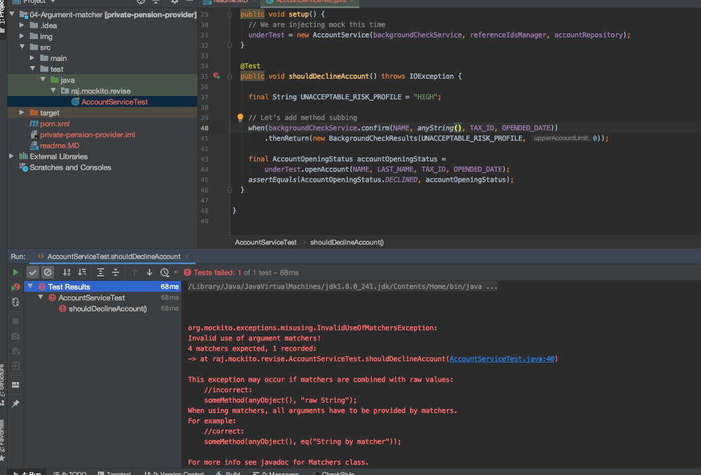

## Argument matcher in Mockito ##
Argument matchers are mainly used for performing flexible verification and stubbing in Mockito.

## Rules to considered while using argument matcher ##
1. Either all the parameters must be argument matcher or they must be assigned value. If we try to mix them then we will have error as given below:


- To solve this issues use
```java
package raj.mockito.revise;

import org.junit.jupiter.api.BeforeEach;
import org.junit.jupiter.api.Test;

import java.io.IOException;
import java.time.LocalDate;

import static org.junit.jupiter.api.Assertions.assertEquals;
import static org.mockito.ArgumentMatchers.anyString;
import static org.mockito.ArgumentMatchers.eq;
import static org.mockito.Mockito.mock;
import static org.mockito.Mockito.when;

class AccountServiceTest {

  // Create instance of AccountService
  private AccountService underTest;

  private BackgroundCheckService backgroundCheckService = mock(BackgroundCheckService.class);
  private ReferenceIdsManager referenceIdsManager = mock(ReferenceIdsManager.class);
  private AccountRepository accountRepository = mock(AccountRepository.class);

  String NAME = "Raj";
  String LAST_NAME = "Bhatta";
  String TAX_ID = "1234";
  LocalDate OPENDED_DATE = LocalDate.of(2020, 10, 2);

  @BeforeEach
  public void setup() {
    // We are injecting mock this time
    underTest = new AccountService(backgroundCheckService, referenceIdsManager, accountRepository);
  }

  @Test
  public void shouldDeclineAccount() throws IOException {

    final String UNACCEPTABLE_RISK_PROFILE = "HIGH";

    // Let's add method subbing
    when(backgroundCheckService.confirm(anyString(), anyString(),eq(TAX_ID), eq(OPENDED_DATE)))
        .thenReturn(new BackgroundCheckResults(UNACCEPTABLE_RISK_PROFILE, 0));

    final AccountOpeningStatus accountOpeningStatus =
        underTest.openAccount(NAME, LAST_NAME, TAX_ID, OPENDED_DATE);
    assertEquals(AccountOpeningStatus.DECLINED, accountOpeningStatus);
  }

}

```

use eq for assigned value.